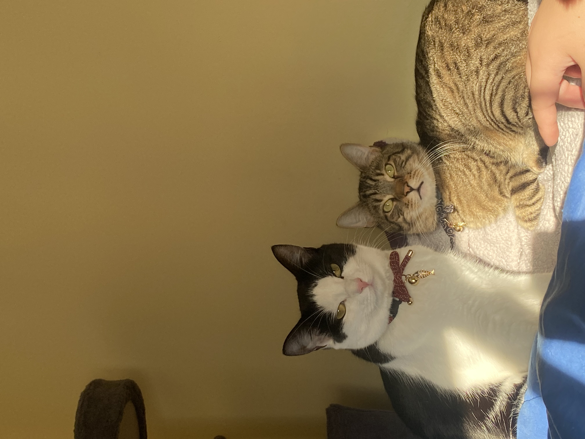
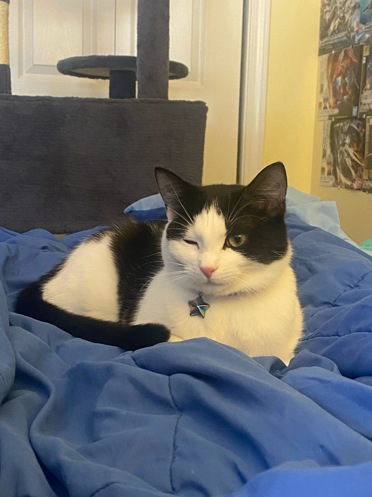

## Hi, I'm Quartz!

Originally from northwest Arkansas, I was raised back and forth between my dad’s big family in rural Arkansas and my mom’s big family in rural Wisconsin. At this point, much of my family is spread out across the US (I am the 3rd oldest of 7 kids), but visiting family always entails going to one of those two states. 

```{r, out.height="25%", out.width="25%", echo=FALSE}
knitr::include_graphics("./images/ar_wi_map.png")
```

Outside of school, I take care of several small animals. I currently have pet rats, a hamster, a frog, a leopard gecko, hermit crabs, and two cats. For rodents I have a 'food names' naming convention, for reptiles and amphibians, I have a 'mythology' naming convention, and so far for the cats we have a Pokemon naming convention. The cats are named Gible (the tabby boy) and Clefable (the tuxedo girl). 

```{r, out.height="25%", out.width="25%", echo=FALSE}

```

*You can find a bunch of cute pictures of my pets if you scroll down on this page! :)*

The rats I have right now are two curly-haired rats named Beef and Butter, my hamster is named Sesame (but my partner calls him Vegeta), my leopard gecko is Chronos, and my chubby frog is named Castor.

Every week I play [D&D](https://en.wikipedia.org/wiki/Dungeons_%26_Dragons) online with my friends in other states, and I generally try to go to concerts and travel as often as possible. The concerts are usually alternative or metal, but I listen to a lot of different things. 


## Pet photos 


```{r, out.height="25%", out.width="25%", echo=FALSE}
knitr::include_graphics("./images/butter.jpg")
knitr::include_graphics("./images/fable.jpg")

```

```{r, out.height="25%", out.width="25%", echo=FALSE}
knitr::include_graphics("./images/gible.jpg")
```

```{r, out.height="25%", out.width="25%", echo=FALSE}
knitr::include_graphics("./images/soup_gouda.jpg")
```

